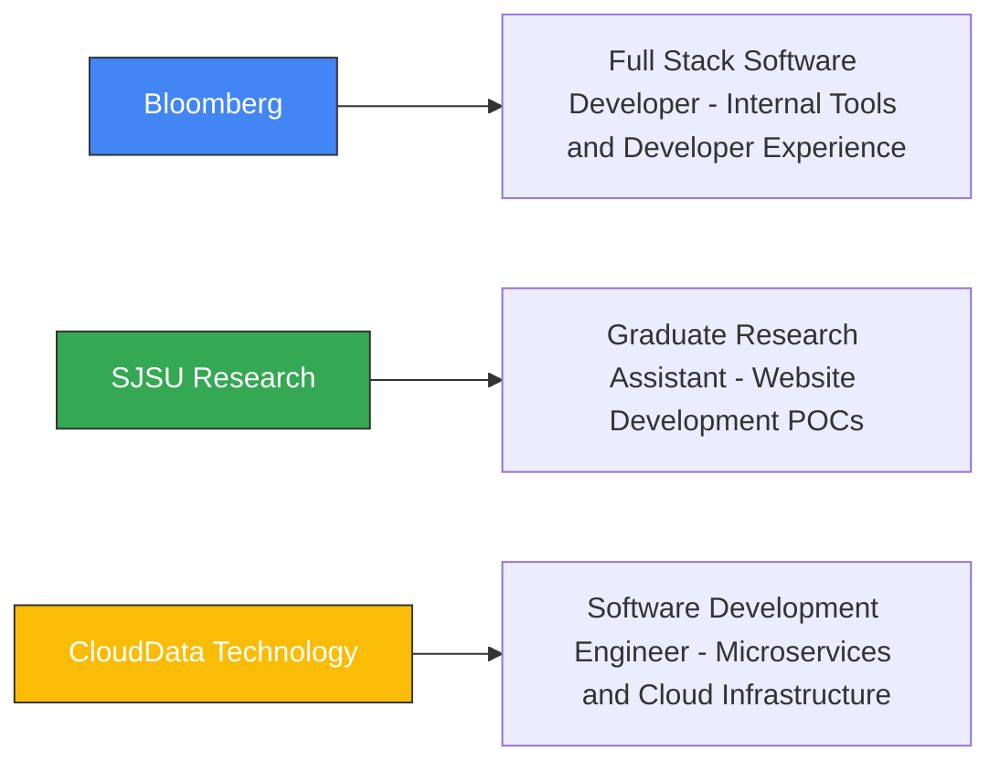

  
# Rohan Patel
### Full-Stack Software Engineer | Cloud Expertise | FinTech | E-Commerce | Enterprise Software | Web Dev

## 💫 About Me

I'm a **Full-Stack Software Engineer** with dual degrees from **San Jose State University** - a **Master's in Software Engineering** specializing in **Cloud & Mobile Computing** and a **Bachelor's in Software Engineering**. Currently at **Bloomberg**, I drive end-to-end feature development and optimize developer workflows for 3000+ internal developers while maintaining a focus on performance and scalability. I am seeking new opportunities to advance my skills in the field of software. I'm open to any domain and learning opportunities. Dedicated to expanding my experiences and taking initiative in the workplace.

My engineering philosophy is guided by an **automation-first mindset**, commitment to **clean, maintainable code**, and a focus on **data-driven improvements** with quantifiable metrics.

## 🚀 Featured Projects

<table>
  <tr>
    <td width="33%" align="center">
      <h3>ApaceSystems</h3>
      
      
      
      
      
🛒 B2B E-commerce platform for elevator components with flexible product customization and robust API architecture.

      <a href="https://github.com/ApaceSystems"><small>View Repository</small></a>
    </td>
    <td width="33%" align="center">
      <h3>TMS</h3>
      
      
      
      
      
🏆 Serverless tournament management system with intelligent bracket assignment and deadlock prevention mechanisms.

      <a href="https://github.com/TournamentManagementSystem/"><small>View Repository</small></a>
    </td>
    <td width="33%" align="center">
      <h3>EzCloudStore</h3>
      
      
      
      
      
      
☁️ 3-tier cloud storage platform with 99.99% uptime and intelligent tiered storage strategy reducing costs by 30%.

      <a href="https://github.com/rohanbpatel14/ezcloudstore"><small>View Repository</small></a>
    </td>
  </tr>
  <tr>
    <td width="33%" align="center">
      <h3>Etsy Marketplace</h3>
      
      
      
      
      
      
🛍️ Full-stack e-commerce platform inspired by Etsy with GraphQL, image uploads to AWS S3, and a modern React frontend.

      <a href="https://github.com/rohanbpatel14/etsy-marketplace"><small>🔗 View Repository</small></a>
    </td>
    <td width="33%" align="center">
      <h3>StackOverflow WebApp Clone</h3>
      
      
      
      
      
      
💬 Microservices-based Stack Overflow clone with Kafka, Redis, and hybrid persistence powered by MySQL and MongoDB.

      <a href="https://github.com/rohanbpatel14/stackoverflow-webapp-clone"><small>🔗 View Repository</small></a>
    </td>
    <td width="33%" align="center">
      <h3>MovInfo - Android Mobile App</h3>
      
      
      
      
      
      
🎬 Android app for browsing and reviewing movies, with modern UI, Kotlin coroutines, material design, and third-party API integration.

      <a href="https://github.com/rohanbpatel14/mov-info"><small>🔗 View Repository</small></a>
    </td>
  </tr>
</table>

## 💻 Technical Stack

### Languages

### Cloud & DevOps

### Backend

### Frontend

### Database

## 🔧 Experience

## 📚 Learning & Growth

Currently focused on:
- **Advanced Cloud Architecture** certification through AWS
- **System Design** patterns for distributed microservices
- **Machine Learning** applications in financial analytics
- **GraphQL** federation and advanced schema design
- **Kubernetes** operators and custom controllers

## 🧠 Engineering Principles

- **Automation-first mindset** to eliminate repetitive tasks
- **Clean, maintainable code** for enhancing **Developer Experience** 
- **Data-driven improvements** with quantifiable metrics
- **Problem-solving mindset** that addresses root causes
- **Test-driven development** focusing on one feature at a time
- **Comprehensive documentation** to accelerate team productivity

## 🌱 Current Focus

- **Advanced Cloud Architectures**: Deepening expertise in serverless, microservices, and event-driven patterns
- **Team Leadership**: Developing skills to lead engineering initiatives and mentor others
- **Infrastructure as Code**: Expanding knowledge of CloudFormation, Terraform, and CDK

## 📫 Contact Me 📧

I'm always open to discussing challenging technical problems, innovative solutions, or new opportunities. Feel free to reach out through any of the channels below!

 

  
  > "Code as if the next developer who will maintain your code is a psychopath who knows where you live."
  
  
  

