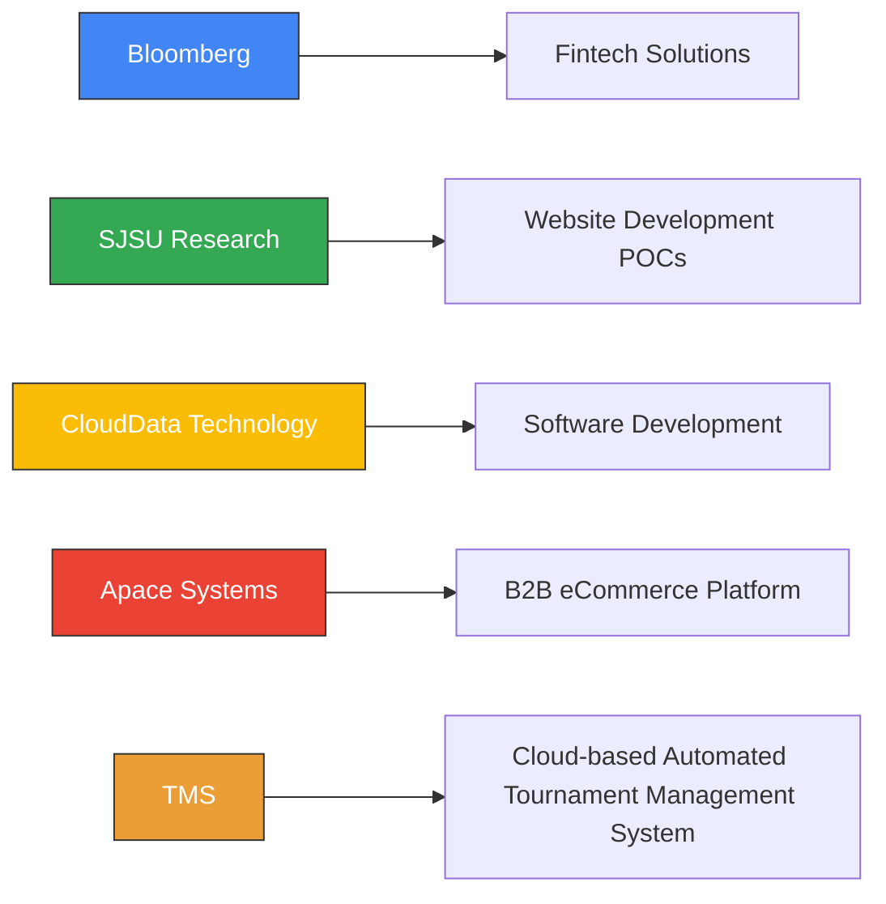

<div align="center">
  
  # Rohan Patel
  ### Full-Stack Software Engineer | Cloud Technologies | FinTech | E-Commerce
  
  [](https://linkedin.com/in/rohanbpatel14)
  [](https://rohanbpatel.netlify.app)
  [](https://instagram.com/findingrohanpatel)
  [](mailto:rohanbpatel98@gmail.com)
  
  
  
</div>

## 💫 About Me

I'm a **Full-Stack Software Engineer** with dual degrees from **San Jose State University** - a **Master's in Software Engineering** specializing in **Cloud & Mobile Computing** and a **Bachelor's in Software Engineering**. Currently at **Bloomberg**, I drive end-to-end feature development and optimize developer workflows while maintaining a focus on performance and scalability.

My professional journey has equipped me with experience in:
- 🚀 Architecting and optimizing developer tools and workflows
- 🏗️ Building serverless and microservice-based applications
- 💻 Creating intuitive, high-performance user interfaces
- ☁️ Designing fault-tolerant, scalable cloud infrastructures
- 📊 Implementing data-driven performance improvements

What sets me apart is my unique combination of technical expertise and business intuition, allowing me to build solutions that are not only technically sound but also aligned with business objectives.

## 🔧 Experience


```mermaid
graph LR
    A[Bloomberg] --> B[Fintech Solutions]
    C[SJSU Research] --> D[Website Development POCs]
    E[CloudData Technology] --> F[Software Development]
    G[Apace Systems] --> H[B2B eCommerce Platform]
    I[TMS] --> J[Cloud-based Automated Tournament Management System]

    style A fill:#4285F4,stroke:#333,stroke-width:1px,color:white
    style C fill:#34A853,stroke:#333,stroke-width:1px,color:white
    style E fill:#FBBC05,stroke:#333,stroke-width:1px,color:white
    style G fill:#EA4335,stroke:#333,stroke-width:1px,color:white
    style I fill:#EA9E35,stroke:#333,stroke-width:1px,color:white
```

## 💻 Technical Stack

<div align="center">

### Languages


### Frontend


### Backend


### Database


### DevOps & Cloud


### Testing


</div>

## 📊 Development Approach

```typescript
interface ImpactMetrics {
  performance: number;
  devExperience: number;
  userSatisfaction: number;
  businessValue: number;
}

class EngineeringExcellence {
  private agileProcess: AgileMethodology;
  private cicdPipeline: ContinuousDeployment;
  private codeQuality: CodeStandards;
  
  constructor() {
    this.agileProcess = new AgileMethodology('Scrum');
    this.cicdPipeline = new ContinuousDeployment();
    this.codeQuality = new CodeStandards({
      testCoverage: 85,
      typeChecking: true,
      semanticCommits: true
    });
  }

  async developFeature(requirements: Requirements): Promise<Feature> {
    // Start with clear requirements and design
    const design = await this.architectSolution(requirements);
    
    // Test-driven development approach
    const tests = this.writeTests(design);
    
    // Implement with clean, maintainable code
    const implementation = await this.implementSolution(design);
    await this.runTests(tests, implementation);
    
    // Measure impact with quantifiable metrics
    const metrics = this.measureImpact(implementation);
    
    // Document thoroughly for future developers
    this.createDocumentation(implementation);
    
    return this.deployToProduction(implementation);
  }

  private measureImpact(solution: Solution): ImpactMetrics {
    // Always quantify the impact of engineering work
    return {
      performance: solution.calculatePerformanceImprovement(),
      devExperience: solution.measureDeveloperProductivity(),
      userSatisfaction: solution.getUserExperienceMetrics(),
      businessValue: solution.calculateROI()
    };
  }
}
```

My engineering philosophy centers is guided by these principles:
- **Automation-first mindset** to eliminate repetitive tasks
- **Clean, maintainable code** for enhancing **Developer experience** 
- **Continuous learning** and adaptation to new technologies
- **Comprehensive documentation** to accelerate team productivity
- **Data-driven improvements** with quantifiable metrics
- **Problem-solving mindset** that addresses root causes with clear communication
- **Test-driven development** focusing on one feature at a time
  
## 🌱 Current Focus

- **Advanced Architectures**: Deepening understanding and experience of serverless, microservices, and event-driven patterns
- **Team Leadership**: Developing skills to lead engineering initiatives and mentor others
- **Communication Skills**: Improving my ability to explain complex solutions clearly
- **Cloud Architecture**: Deepening expertise in distributed systems and cloud-native patterns
- **Frontend Performance Optimization**: Exploring advanced React patterns and state management
- **Infrastructure as Code**: Expanding knowledge of CloudFormation, Terraform, and CDK

## 📫 Let's Connect

I'm always open to discussing challenging technical problems, innovative solutions, or new opportunities. Feel free to reach out through any of the channels above!

<div align="center">
  
  > "Measure twice, code once. Then measure again to prove the impact."
  
  
  
</div>

<!-- GitHub Stats Section -->
<details>
  <summary>📊 GitHub Stats</summary>
  <div align="center">
    
  </div>
</details>
