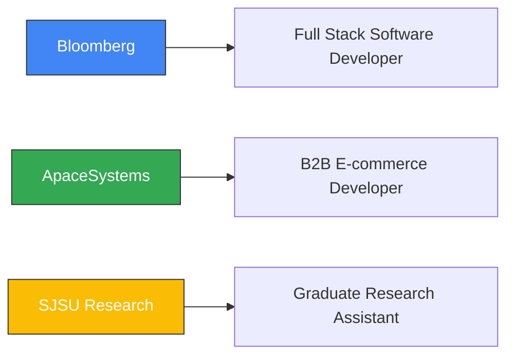

  
# Rohan Patel
### Full-Stack Software Engineer | Cloud Architect | FinTech | E-Commerce

## 💫 About Me

I'm a **Full-Stack Software Engineer** with dual degrees from **San Jose State University** - a **Master's in Software Engineering** specializing in **Cloud & Mobile Computing** and a **Bachelor's in Software Engineering**. Currently at **Bloomberg**, I drive end-to-end feature development and optimize developer workflows for 3000+ internal developers while maintaining a focus on performance and scalability.

My engineering philosophy is guided by an **automation-first mindset**, commitment to **clean, maintainable code**, and a focus on **data-driven improvements** with quantifiable metrics.

---

## 🚀 Featured Projects

<table>
  <tr>
    <td width="33%" align="center">
      <h3>ApaceSystems</h3>
      
      
      
      
B2B E-commerce platform for elevator components with flexible product customization and robust API architecture.

    </td>
    <td width="33%" align="center">
      <h3>TMS</h3>
      
      
      
      
Serverless tournament management system with intelligent bracket assignment and deadlock prevention mechanisms.

    </td>
    <td width="33%" align="center">
      <h3>EzCloudStore</h3>
      
      
      
      
3-tier cloud storage platform with 99.99% uptime and intelligent tiered storage strategy reducing costs by 30%.

    </td>
  </tr>
</table>

## 💻 Technical Stack

### Languages

### Cloud & DevOps

### Backend

### Frontend

### Database

## 🔧 Experience

```mermaid
graph LR
    A[Bloomberg] --> B[Full Stack Software Developer]
    C[ApaceSystems] --> D[B2B E-commerce Developer]
    E[SJSU Research] --> F[Graduate Research Assistant]

    style A fill:#4285F4,stroke:#333,stroke-width:1px,color:white
    style C fill:#34A853,stroke:#333,stroke-width:1px,color:white
    style E fill:#FBBC05,stroke:#333,stroke-width:1px,color:white
```

## 🧠 Engineering Principles

- **Automation-first mindset** to eliminate repetitive tasks
- **Clean, maintainable code** for enhancing **Developer Experience** 
- **Data-driven improvements** with quantifiable metrics
- **Problem-solving mindset** that addresses root causes
- **Test-driven development** focusing on one feature at a time
- **Comprehensive documentation** to accelerate team productivity

## 🌱 Current Focus

- **Advanced Cloud Architectures**: Deepening expertise in serverless, microservices, and event-driven patterns
- **Team Leadership**: Developing skills to lead engineering initiatives and mentor others
- **Infrastructure as Code**: Expanding knowledge of CloudFormation, Terraform, and CDK

## 📫 Let's Connect

I'm always open to discussing challenging technical problems, innovative solutions, or new opportunities. Feel free to reach out through any of the channels above!

  
  > "Code as if the next developer who will maintain your code is a psychopath who knows where you live."
  
  
  

<!-- GitHub Stats Section -->

  
📊 GitHub Stats

  

    
  

